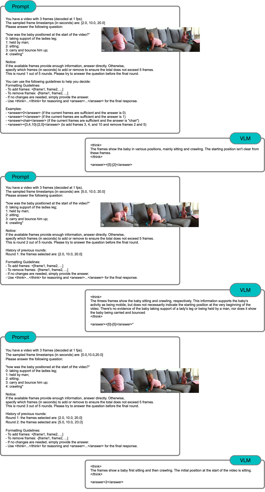

# Sparse-Video-R1: Advanced Video Understanding with Adaptive Frame Sampling


*Figure 1: Conceptual illustration of Sparse-Video-R1's multi-round dialogue process.*


## 1. What is Sparse-Video-R1?
Sparse-Video-R1 is a lightweight extension for **Vision-Language Models (VLMs)** that teaches them to reason about *which* video frames they actually need.  
Inspired by R1-style fine-tuning for LLMs, we introduce a **multi-round dialogue loop**:

1. **Round t** – The VLM receives a small set of frames plus the question.  
2. The model *thinks* ("Is this enough to answer?").  
3. If not, it *asks* for more evidence by selecting new timestamps (frames).  
4. We sample those frames and repeat until the answer is confidently produced or the turn limit is reached.

This self-curated framing leads to sharper grounding, lower latency, and better accuracy on video QA benchmarks.



*Figure 2: A concrete example of Sparse-Video-R1 in action.*

---

## 2. Recent Changes
| Date       | Change                                               |
|------------|------------------------------------------------------|
| 2025‑04‑13 | Initial public release – code, docs, and NExT‑QA demo scripts. |
| 2025‑04‑14 | More testing functions under `Sparse-Video-R1/scripts/test`. |

---

## 3. Installation

> **Prerequisites**  
> • CUDA 11.8+ (A100/H100 recommended)  
> • Python 3.10  
> • Conda (Miniconda or Anaconda)  
> • 4x80G GPU (for 3B/7B Qwen-2.5-VL model)

```bash
# 1️⃣ Create a clean environment
conda create -n VideoR1 python=3.10 -y
conda activate VideoR1

# 2️⃣ Install VERL (base repo)
cd verl
pip install -e .

# 3️⃣ Install the runtime stack
pip install vllm==0.8.2          # vLLM backend for efficient inference
pip install flash-attn --no-build-isolation  # Flash attention for faster training
pip install tensordict==0.6.2    # TensorDict for efficient data handling
pip install --upgrade torchao    # PyTorch AO (Automatic Optimization)

# 3.1 Transformer & utility extras
pip install git+https://github.com/huggingface/transformers  # Latest transformers for Qwen-VL 2.5 support
pip install accelerate         # Hugging Face's acceleration library
pip install qwen-vl-utils[decord]  # Faster video decoding (strongly recommended)
```

## 4. Preparing the NExT-QA Demo Dataset
We use the open-sourced NExT-QA dataset from Google Drive. Install gdown if you don't have it:
```bash
pip install gdown
```

Then download and unpack:
```bash
# 4️⃣ Fetch everything
cd /path/to/raw_data
gdown --folder https://drive.google.com/drive/folders/1gKRR2es8-gRTyP25CvrrVtV6aN5UxttF

# 5️⃣ Unzip
cd NExT-QA
unzip NExTVideo.zip
unzip nextqa.zip
unzip test-data-nextqa.zip
```

## 5. Quick Start

Before running the training script, update the following variables in the respective scripts:

- **HF_HOME:** Directory for storing your model (Hugging Face cache)
- **DATA_DIR:** Directory for storing the data processed by `dataset/NExT_QA.py`
- **RAW_DATA:** Path to where you downloaded the NExT-QA dataset

Make sure to update these variables in both:
- `scripts/run_qwen2_5_vl_template.sh`
- `train.sh`

Then, launch the minimal training pipeline:
```bash
sh train.sh
```

## 6. Results

### 6.1 NExT-QA Benchmark Results

| Model | Input Type | # Frames | Accuracy |
|-------|------------|----------|----------|
| GPT-4o | Frames | 5 | 76% |
| Qwen-2.5-VL-3B | Frames | 5 | 50% |
| Qwen-2.5-VL-3B | Full Video | - | 69% |
| Sparse-Video-R1 | Frames | 5 | 73% |

> Note: More baselines and results are coming.

### 6.2 Implementation Details

#### Sparse-Video-R1 Configuration
- **Base Model**: Qwen-2.5-VL-3B
- **Frame Sampling Strategy**:
  - Initial sampling: Random
  - Maximum frames per round: 5
  - Maximum rounds: 5
- **Training Setup**:
  - Hardware: 4x80G GPU (A100/H100 recommended)
  - Training samples: 1,000 from training set
  - Validation samples: 1,000 from validation set

#### Baseline Models Configuration
- **Test Setup**:
  - Validation samples: 1,000 from validation set
  - Frame sampling: Random

For detailed baseline results and evaluation scripts, please refer to `scripts/test/`.

### 6.3 Training Curves


*Figure 3: Training curve showing the performance of Qwen-2.5-VL-3B with random frame sampling strategy.*


## 7. Acknowledgments

This project builds upon several foundational works:

- **VERL Framework**: We extend the `verl: Volcano Engine Reinforcement Learning for LLMs` framework. The original codebase can be found at [verl GitHub Repository](https://github.com/volcengine).

- **RAGEN**: Our multi-round dialogue implementation is based on the R1-style conversation approach from [RAGEN](https://github.com/RAGEN-AI/RAGEN).

### Key Modifications and Extensions

Our implementation introduces several modifications to the base frameworks:

1. **Multi-frame VLM Support**: 
   - Modified the RL-dataset to support multi-frame inputs for vision-language models

2. **Multi-round Dialogue Loop**:
   - Implemented a vLLM-based generation loop for iterative frame requests
   - Also based on RAGEN's conversation architecture

3. **Reward Function**:
   - Implemented a new reward function to handle different types of outputs

The key functionality of our framework is under `verl/verl/utils/agents`.

## 8. Citation

```
@misc{Sparse-Video-R1,
author       = {Chenwei Xu and Zheng Ye and Zhuofan Xia and Shang Wu and Weijian Li and Pranav Maneriker and Lie Lu and Fan Du and Manling Li and Han Liu},
title        = {Sparse-Video-R1: Advanced Video Understanding with Adaptive Frame Sampling},
howpublished = {https://github.com/Chenwei-1999/Sparse-Video-R1},
note         = {Accessed: 2025-04-14},
year         = {2025}
}
```

## 9. License

This project is licensed under the MIT License - see the [LICENSE](LICENSE) file for details.
